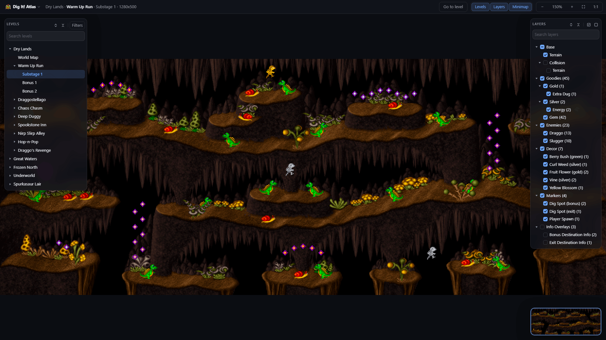
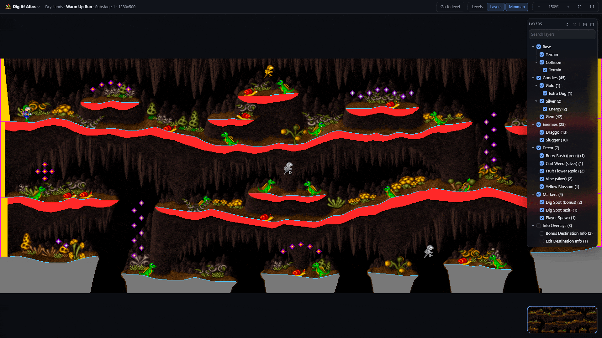
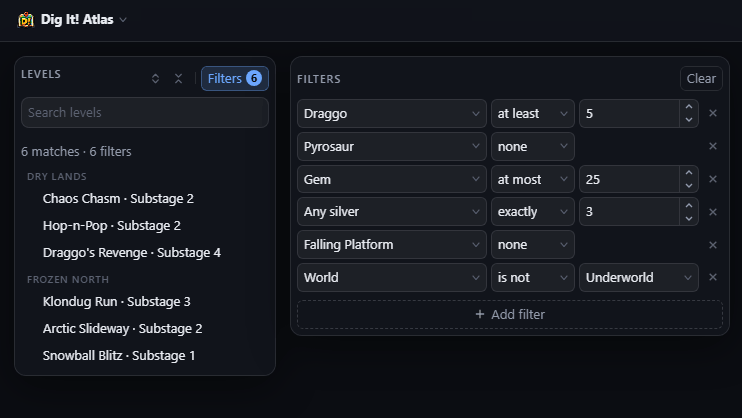
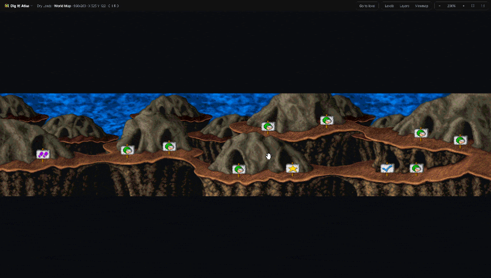

<div align="center">

# Dig It! Atlas

**Maps every Dig It! level in the browser, with layers, entity positions, and interactive navigation.**

[](#changelog)
[](LICENSE)
[](https://devilquest.github.io/DigItAtlas/)


**[Open Dig It! Atlas](https://devilquest.github.io/DigItAtlas/)**

</div>

---

## Table of Contents

### General Information
- [About the Project](#about-the-project)
- [Key Features](#key-features)
- [How It Works](#how-it-works)
- [Motivation](#motivation)

### Technical Deep Dive
- [Getting Started](#getting-started)
- [Where the Data Comes From](#where-the-data-comes-from)
- [Architecture & Technologies](#architecture-and-technologies)
- [Roadmap](#roadmap)
- [Credits & Contact](#credits-and-contact)
- [Changelog](#changelog)
- [License](#license)
- [Donations](#donations)

---

## About the Project

Dig It! Atlas is an interactive web-based atlas providing maps for **Dig It!** (Pixel Painters Corp., 1996), a 16-bit DOS platformer. It presents all **125 level maps and 5 world maps** with every enemy, collectible goodies, moving platform, and dig spot placed at its exact in-game coordinates.

The atlas is designed for spatial lookup, level navigation, and route planning. It clarifies where stage exits lead, which levels feature specific enemy types, how many goodies each substage holds, and where each dig spot leads.

The application runs entirely in the browser as a static single-page application. All maps were rendered from the original game data and are served as static assets, allowing exploration without an emulator, local game files, or server installation.

Dig It! Atlas focuses specifically on comprehensive map visualization. Asset extraction, raw file browsing, and audio synthesis are handled by its companion desktop tool, [Dig It! Explorer](https://github.com/Devilquest/DigItExplorer).

*Dig It! © 1996 Pixel Painters Corp. This is an unofficial fan project, not affiliated with or endorsed by Pixel Painters Corp. or any publisher of the game. It redistributes no original game assets: all displayed maps and sprites are pre-rendered reference data.*

<div align="center">
  
</div>

---

## Key Features

- **Complete map catalog**: Covers all 125 level maps and 5 world maps, using the original in-game titles extracted from the game data rather than internal file stems.
- **Independent layer controls**: Toggle terrain, enemies, goodies, mechanisms, and the original game collision layer.
- **Multi-criteria filtering**: Combine multiple conditions to find levels matching specific criteria, such as at least 3 Draggo enemies, 5 gems, and 1 extra life.
- **Instant search**: Search level titles in real time with matching text highlighted.
- **Click-to-travel navigation**: Navigate between maps by clicking dig spots to open their destination maps, following the same routes as in the game.
- **Interactive minimap**: Shows the full level with the current viewport and allows navigation by clicking or dragging.
- **Stable map URLs**: Each map has a unique URL hash based on its internal stage coordinates (`#/1-1-1`), ensuring links continue to point to the same map across releases.
- **Pixel-perfect scaling**: Uses nearest-neighbor scaling to preserve the original pixel art at all zoom levels.
- **Keyboard shortcuts**: Shortcuts for panels, zoom levels (`0` for fit to view, `1` for 100%), and layer toggles (`C` for collision, `E` for enemies, `G` for goodies).
- **Persistent local state**: Remembers open panels, expanded sections, and other interface settings using browser `localStorage`.
- **Zero telemetry and tracking**: No backend, analytics, tracking scripts, or data collection.

---

## How It Works

1. **Select a map**: Open the Levels panel (`L`), select `Go to map` (`Ctrl / Cmd + K`) to search by name, or navigate directly via URL.
2. **Navigate the canvas**: Drag to pan, scroll to zoom, or use the Minimap (`M`) to navigate. Press `0` to fit the map to the viewport, or `1` for original 1:1 scale.
3. **Toggle visibility layers**: Open the Layers panel (`Y`) to toggle individual layers. Shortcuts `C`, `E`, and `G` toggle collision, enemies, and goodies directly.

<div align="center">
  
</div>

4. **Filter stages**: Open the Filters panel (`F`) from the level list to find stages matching multiple criteria and quantities.

<div align="center">
  
</div>

5. **Interactive map elements**: Hover over enemies, goodies, and other map elements to view their details. Click interactive dig spots to navigate to the maps they lead to. Dig It! Atlas prefetches connected maps in the background.

<div align="center">
  
</div>

A full user guide covering destination markers and interaction details is available from the top menu.

---

## Motivation

Dig It! Atlas began as an attempt to create complete maps of Dig It! for route planning and to provide a view of each level as a whole. No maps were available, so the initial approach was to capture the game screen and manually stitch screenshots together, removing the interface, player, and enemies from each section. Creating a single map could take several hours.

As the process became more automated, it became clear that the game already contained the information needed to reconstruct its maps: terrain, collision data, and entity positions. Reverse-engineering the game archives made it possible to reconstruct that data directly instead of relying on screenshots.

Dig It! Atlas is the result of that transition. It presents the reconstructed maps as a browser-based reference, with the different layers and entities separated so they can be inspected independently.

The project follows two principles:

- **Static delivery**: The atlas is generated from the original game data and served as static assets, so visitors do not need to provide game files or run an emulator.
- **Reference focus**: The atlas presents reconstructed maps and their associated data as an interactive reference rather than distributing the original game files or extracted assets.

---

## Technical Deep Dive

## Getting Started

### Prerequisites

- **Browser**: Modern desktop or laptop browser (Chrome, Firefox, Safari, Edge). The interface is designed for 1920x1080 or larger displays.
- **Build Requirements**: Node.js 20.19+ or 22.12+ (only required when building from source).

### Access Online

Visit the hosted version at **[Dig It! Atlas](https://devilquest.github.io/DigItAtlas/)**. No installation or setup is required.

### Building From Source

1. **Clone the repository**:
   ```bash
   git clone https://github.com/Devilquest/DigItAtlas.git
   cd DigItAtlas
   ```
2. **Install dependencies and start development server**:
   ```bash
   npm install
   npm run dev
   ```
3. **Build production bundle**:
   ```bash
   npm run build
   ```
4. **Run unit tests**:
   ```bash
   npm test
   ```
5. **Preview local production build**:
   ```bash
   npm run preview
   ```
   *Note: Because modern web applications rely on ES modules, opening `dist/index.html` directly via the `file://` protocol will fail. Serve the folder through a local HTTP server such as `npm run preview`, `npx serve dist`, or `python -m http.server 8080`.*

### Troubleshooting

- **Blank screen on deployment**: Verify the `base` path setting in `vite.config.ts`. If hosting in a repository subpath (such as GitHub Pages), the base path must match the deployment directory.
- **Build fails on catalog ID**: Ensure `public/data/catalog.json` is present. Data requests append a build identifier to guarantee cache consistency.

---

## Where the Data Comes From

### Deterministic Asset Pipeline

Map tiles and entity data are decoded directly from the original game archives, with objects positioned according to the original stage entity records. The extraction and composition pipeline runs offline before publishing.

### Published Assets vs. Original Files

The repository distributes no original game binaries, archives, or executable code. Published data consists solely of derived output: composite map images and structured JSON catalogs.

Level and world names are extracted from the executable's node information table, while enemy species names originate from the ending gallery. A small number of unnamed mechanisms, such as moving platforms and dig spots, use standardized descriptive labels consistent with [Dig It! Explorer](https://github.com/Devilquest/DigItExplorer).

### Lossless WebP Compression

Dig It! features 8-bit palette-indexed pixel art. Lossy image compression formats introduce edge artifacts and color shifts that compromise pixel clarity.

Every map is encoded using lossless WebP at maximum compression effort. On a representative $1280 \times 500$ map with 97 colors, compression compares against PNG as follows:

| Format / Mode | File Size (% of 24-bit PNG) | Bit-Exact Pixels |
| :--- | :--- | :--- |
| PNG (24-bit) | 100% | Yes |
| PNG (8-bit indexed) | 52% | Yes |
| **WebP (Lossless)** | **41%** | **Yes** |
| WebP (Lossy, Q=90) | 30% | No |
| WebP (Lossy, Q=80) | 16% | No |

Lossless WebP reduces data transfer to approximately 41% of standard PNG size without altering a single pixel value.

### Three-Tier Loading Architecture

To serve 125 full-scale maps efficiently without a backend server, the application splits data loading into three sequential tiers:

| Tier | Lifecycle | Assets Loaded |
| :--- | :--- | :--- |
| **1. Initial** | During the loading screen | Common object sprites and the initial map |
| **2. Background** | After the initial map renders | Maps directly reachable from the current map, plus the parent world map |
| **3. On-Demand** | Upon user navigation | Any other map requested during browsing |

The initial loading screen remains visible until the common sprites and initial map are loaded. Connected maps are then loaded in the background while the current map remains interactive. This limits initial data transfer by avoiding loading the complete 125-map atlas at startup.

### Uniform URL Scheme

Maps use a coordinate-based hash routing structure:

```text
#/1-1-1      World 1, Level 1, Substage 1
#/map/2      World 2 level-selection map
```

Using numeric stage indices ensures links remain stable across different game releases regardless of localized title variations.

---

## Architecture & Technologies <a id="architecture-and-technologies"></a>

### Tech Stack

| Component | Technology | Purpose |
| :--- | :--- | :--- |
| **Language** | TypeScript | Type safety across domain models and data schemas |
| **UI Library** | React 19 | Interface panels and navigation controls |
| **Rendering Engine** | HTML5 Canvas 2D | Pan, zoom, and layer compositing |
| **Build Tool** | Vite 8 | Development server and static bundling |
| **Testing** | Vitest | Domain logic and utility tests |

The application minimizes external runtime dependencies to `react` and `react-dom`. Interface icons are embedded SVG, styling uses standard CSS custom properties, and routing operates via a lightweight URL fragment handler.

### Project Structure

```text
.
├── index.html               Application shell and initial loading screen
├── public/
│   └── data/                Pre-rendered map tiles, sprites, and JSON catalogs
├── src/
│   ├── engine/              Canvas rendering, viewport transforms, hit testing, minimap (No React)
│   ├── domain/              Types, filtering logic, layer models, search algorithms (No React)
│   ├── data/                Client fetching and three-tier prefetch store
│   ├── state/               Active viewport, layer selections, and UI panel state
│   ├── ui/                  React navigation panels, toolbar, dialogs, and canvas host
│   └── styles/              Modular CSS with theme custom properties
└── vite.config.ts           Build configuration and asset hashing
```

### Decoupled Core Architecture

The core rendering engine and domain logic operate independently of React. Coordinate transformations, canvas drawing, hit testing, and filter evaluations are implemented as standard TypeScript modules.

Viewport transform coordinates are held in mutable references and applied directly to the canvas, avoiding React component re-renders during panning and zooming.

---

## Roadmap

Version 1.0.0 provides complete map coverage, layer control, filtering, map navigation, and keyboard navigation.

Future roadmap considerations:

- [ ] **Interactive route drawing**: Tools to draw freehand paths, place pins, and annotate levels for speedrun planning.
- [ ] **Route URL serialization**: Encoding drawn routes into shareable URLs.
- [ ] **Extended URL state**: Encoding zoom coordinates and active layer sets directly into the share link.

---

## Credits & Contact <a id="credits-and-contact"></a>

### Authors
- **Devilquest** - *Lead Developer* - [@devilquest](https://github.com/devilquest)

### Acknowledgments
- **Pixel Painters Corp.** for Dig It! (1996).
- **Frenkel Smeijers**, author of [PPExt](https://sfprod.shikadi.net/), whose research into Pixel Painters archive formats enabled resource reconstruction.

### Dig It! Toolset
- **[Dig It! Explorer](https://github.com/Devilquest/DigItExplorer)**: Browses and reconstructs Dig It! levels, animations, screens, and audio from a local copy with no emulator.
- **[Dig It! Patcher](https://github.com/Devilquest/DigItPatcher)**: Repairs a damaged copy of Dig It! and fixes bugs in the original version.

---

## Changelog

### [1.0.1]
- **Fixed**: Same-level maze exits now use the help cursor without canvas navigation and clarify their destination with `(this level)` in tooltips.
- **Fixed**: Level completion exits and destination overlays now specify `World Map` as their destination route in tooltips.
- **Added**: Identity labels and destination metadata to `Exit Destination Info` and `Bonus Destination Info` overlays on hover.

### [1.0.0]
- **Added**: Initial release.
  - Interactive map viewer covering all 125 level maps and 5 world maps.
  - Layer toggle controls with collision layer overlays.
  - Click-to-travel navigation with in-game labels.
  - Entity-based filtering and real-time level search.
  - Interactive minimap and keyboard navigation shortcuts.
  - Three-tier data loading and background prefetching.
  - Lossless WebP compression with nearest-neighbor scaling.

---

## License

This project is licensed under the [MIT License](LICENSE).

Copyright (c) 2026 Devilquest.

---

## Donations
**Donations are always greatly appreciated. Thank you for your support!**

<div align="center">
<a href="https://www.buymeacoffee.com/devilquest" target="_blank"></a>
</div>
